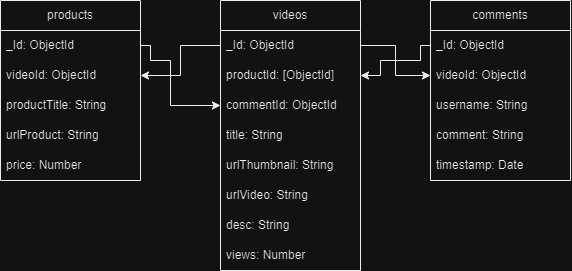

# tokpedPlay
This is Tokped Play Clone

# How to Run
```bash
npm install
add .env file {
    - Add PORT
    - Add DATABASE_URL(fill with mongodb url, example : "mongodb://127.0.0.1:27017/tokpedPlay")
}
connect mongodb
create new database
create this collection {
    - videos
    - products
    - comments
}
import document to mongodb from database folder
npm start
```

# Database Structure

# API Structure

# List API
* Video Thumbnail List
* Video Detail List
* Product List
* Comment List
* Submit Comment

**GET/ Video Thumbnail List**
-----
Returns all videos in the system.
* **URL Path**
  localhost:3000/api/videos
* **URL Params**  
  None
* **Data Params**  
  None
* **Headers**  
  Content-Type: application/json
* **Success Response:**  
  * **Code:** 200  
* **Error Response:**  
  * **Code:** 500  

**GET/ Video Detail List**
-----
Returns videos by id in the system and also return product list and comment list.
* **URL Path**
  localhost:3000/api/videos/:id
* **URL Params**  
  *Required:* `id=[ObjectId]`
* **Data Params**  
  None
* **Headers**  
  Content-Type: application/json
* **Success Response:**  
  * **Code:** 200
* **Error Response:** 
  * **Code:** 500

**POST/ Submit Comment**
-----
Returns videos by id in the system.
* **URL Path**
  localhost:3000/api/videos/:id/comment
* **URL Params**  
  *Required:* `id=[ObjectId]`
* **Data Params**  
```
  {
    username: string,
    comment: string
  }
```
* **Headers**  
  Content-Type: application/json
* **Success Response:**  
  * **Code:** 200
* **Error Response:** 
  * **Code:** 400
